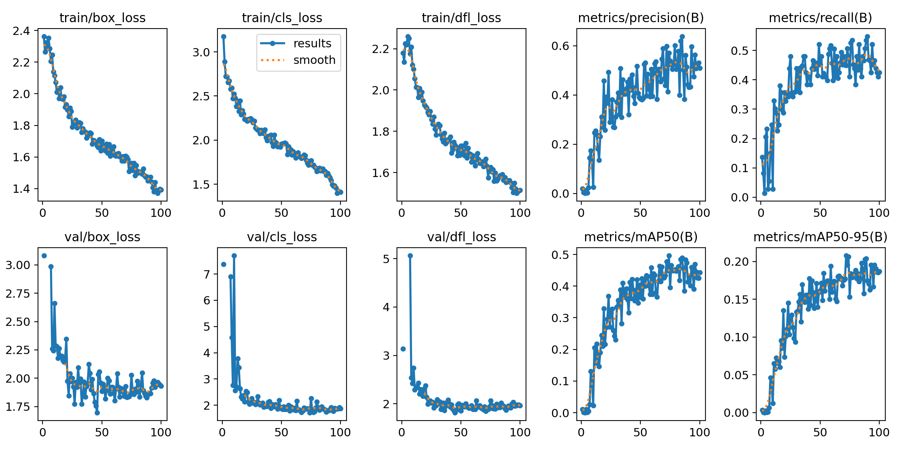
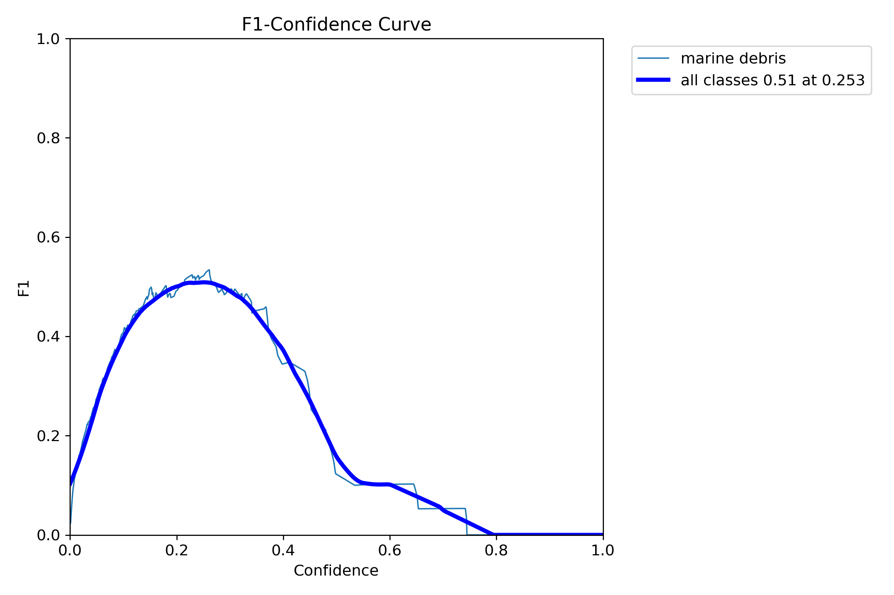
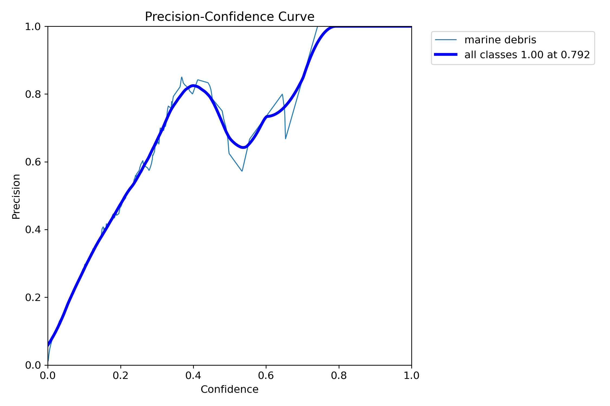
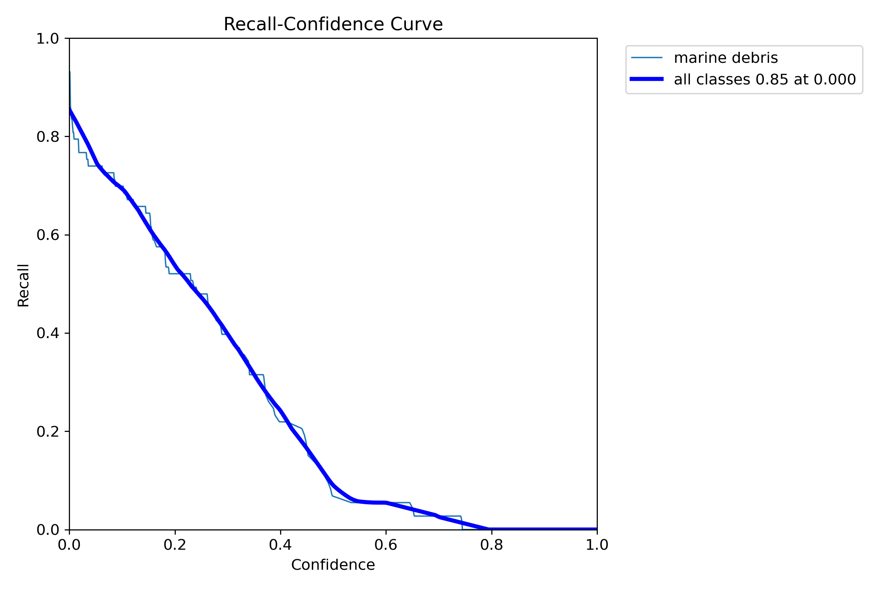
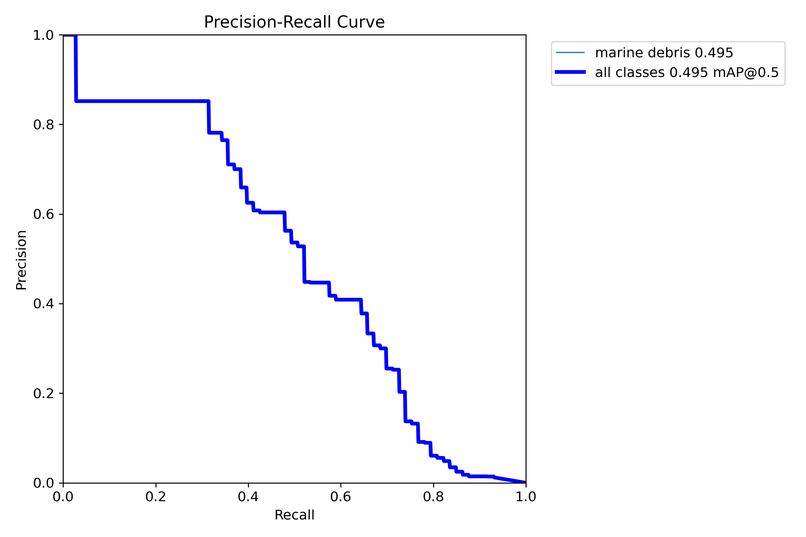
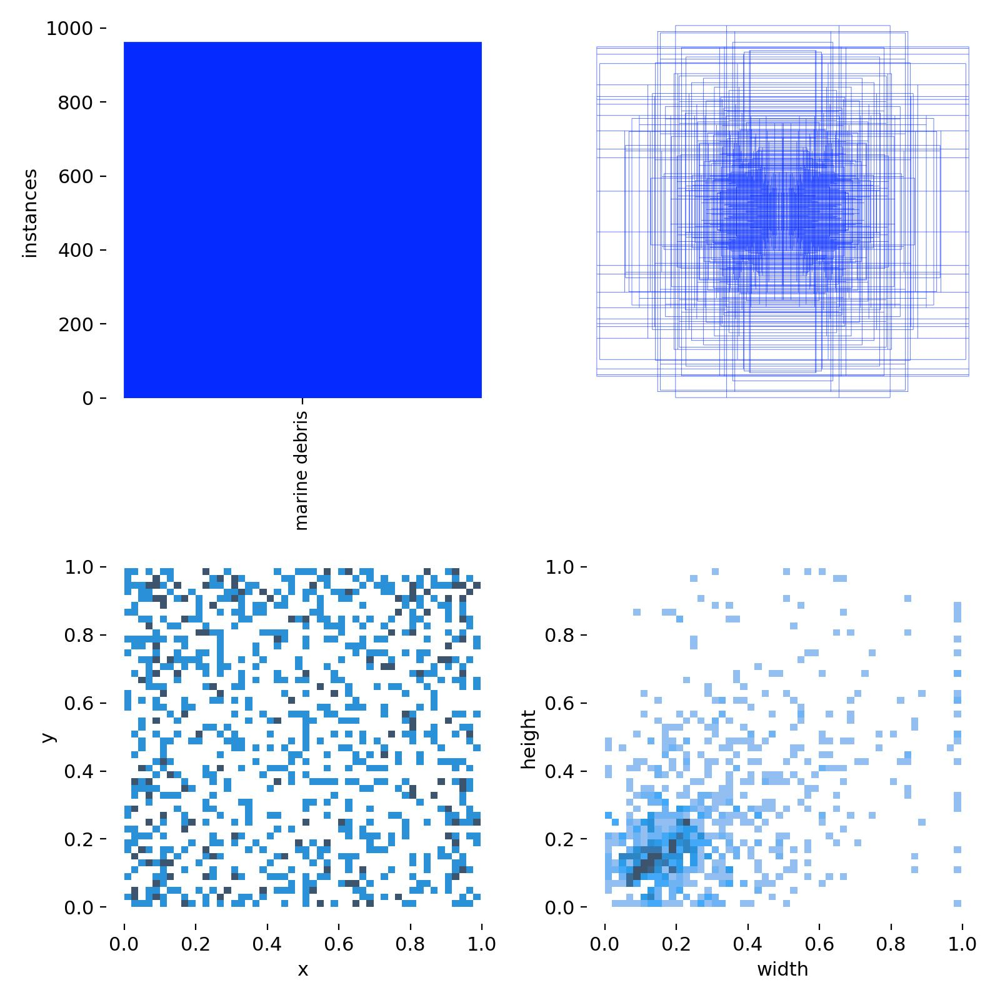
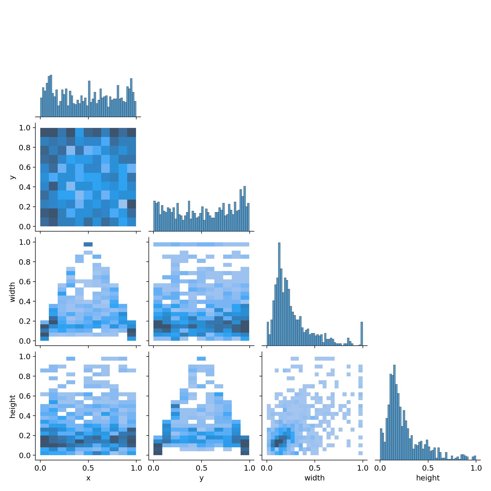
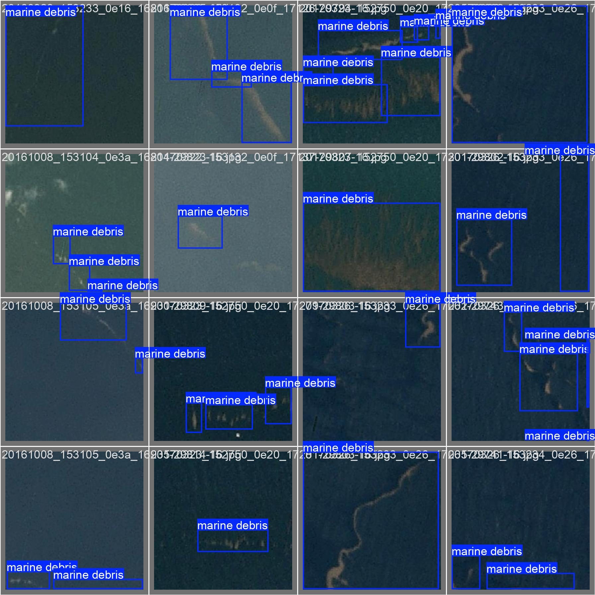

# Marine Debris Detection using YOLOv8 on Satellite Imagery

This repository presents a modular object detection pipeline for identifying **marine debris** in satellite images using **YOLOv8**.  
We fine-tune a YOLOv8m model on geospatial satellite data, enabling detection of floating debris and similar marine pollutants in real-world ocean conditions.

The pipeline includes:
- Inference using pretrained YOLOv8m model
- Bounding box evaluation (IoU, precision, recall, F1-score)
- Visualization of predicted and ground-truth boxes on test images

## Dataset

This project uses satellite imagery and bounding box annotations originally prepared by NASA-IMPACT for marine debris detection.  
The dataset is provided in standard **YOLO format** and contains images of marine environments with labeled floating debris.

The test data is structured as follows:

```
data_yolo/
└── test/
    ├── images/      # Input satellite image tiles (.jpg)
    └── labels/      # Corresponding YOLO annotations (.txt)
```

Each label file contains bounding boxes in this format:
```
<class_id> <x_center> <y_center> <width> <height>
```

> All values are normalized floats (0–1).  
> This task involves a single class: `marine debris`.

---

#### Dataset Attribution

**Note:** This dataset and its annotations were directly sourced from the official NASA-IMPACT project:

> **Marine debris detection with commercial satellite imagery and deep learning**  
> GitHub: [https://github.com/NASA-IMPACT/marine_debris_ML](https://github.com/NASA-IMPACT/marine_debris_ML)  
> © NASA IMPACT Project – All credit for data curation and annotation belongs to the original authors.

## Installation & Setup

Create the conda environment:

```bash
conda env create -f environment_yolo.yaml
conda activate yolo
```

To train the model from scratch:

```bash
python src/train_yolo.py
```

This downloads `yolov8m.pt` and saves the trained model to:

```
runs/detect/yolov8m_b16/weights/best.pt
```

The pretrained model is already available at the above path.

To evaluate the model:

```bash
python src/eval_yolo.py
```

To visualize the predictions:

```bash
python src/vis_yolo.py
```

Outputs are saved to:

```
vis_outputs/
```
## Results & Performance

The final model was trained for 100 epochs with YOLOv8m (`yolo11m.pt`) at 320×320 resolution using a confidence threshold of 0.1 and IoU threshold of 0.3.


| Metric           | Value   |
|------------------|---------|
| True Positives   | 57      |
| False Positives  | 35      |
| False Negatives  | 36      |
| Accuracy         | 0.4453  |
| Precision        | 0.6196  |
| Recall           | 0.6129  |
| F1-score         | 0.6162  |


---

#### Model Training Curves

The following plots were generated during training and are saved in the `runs/` directory:

- **Loss and mAP curves:**  
  

**F1 vs Confidence | Precision vs Confidence | Recall vs Confidence | Precision-Recall Curve:**
<p align="center">
  
  
  
  
</p>

**Label distribution and correlation:**
<p align="center">
  
  
</p>

---

#### Model Predictions vs Ground Truth

A sample grid of predicted and ground-truth bounding boxes is shown below:

- 

For full-resolution predictions overlaid with bounding boxes, refer to the outputs in:

```
vis_outputs/
```

Green: ground truth  
Red: YOLOv8 predictions

## Folder Structure

```
.
├── config_yolo2.yaml              # YOLO dataset config file
├── environment_yolo.yaml          # Conda environment definition
├── yolov8m.pt                     # Base pretrained YOLOv8 model
├── data_yolo/
│   └── test/
│       ├── images/                # Test satellite images
│       └── labels/                # YOLO-format ground truth labels
├── runs/
│   └── detect/
│       └── yolov8m_b16/           # Training logs and model outputs
│           ├── weights/           # Contains best.pt
│           ├── results.png        # Loss & metric plots
│           ├── F1_curve.png       # F1 vs confidence
│           ├── PR_curve.png       # Precision-Recall curve
│           └── ...
├── vis_outputs/                   # Output images from vis_yolo.py
├── src/
│   ├── config_yolo.py
│   ├── train_yolo.py
│   ├── eval_yolo.py
│   ├── vis_yolo.py
│   └── utils_yolo.py
```

---

## Citation

If you use this repository or parts of it in your research or project, please cite:

- Ultralytics YOLOv8: https://github.com/ultralytics/ultralytics
- NASA-IMPACT Marine Debris ML: https://github.com/NASA-IMPACT/marine_debris_ML

---

## Acknowledgements

- NASA-IMPACT for the open-source marine debris detection dataset.
- Ultralytics for the YOLOv8 detection framework.
- All open-source contributors and developers of PyTorch, OpenCV, and supporting tools.